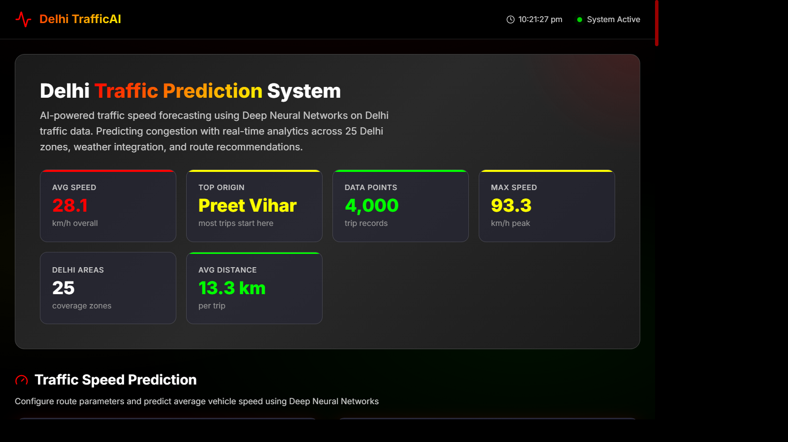
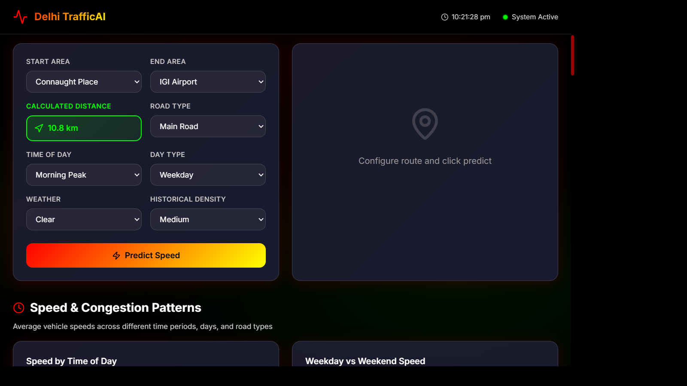
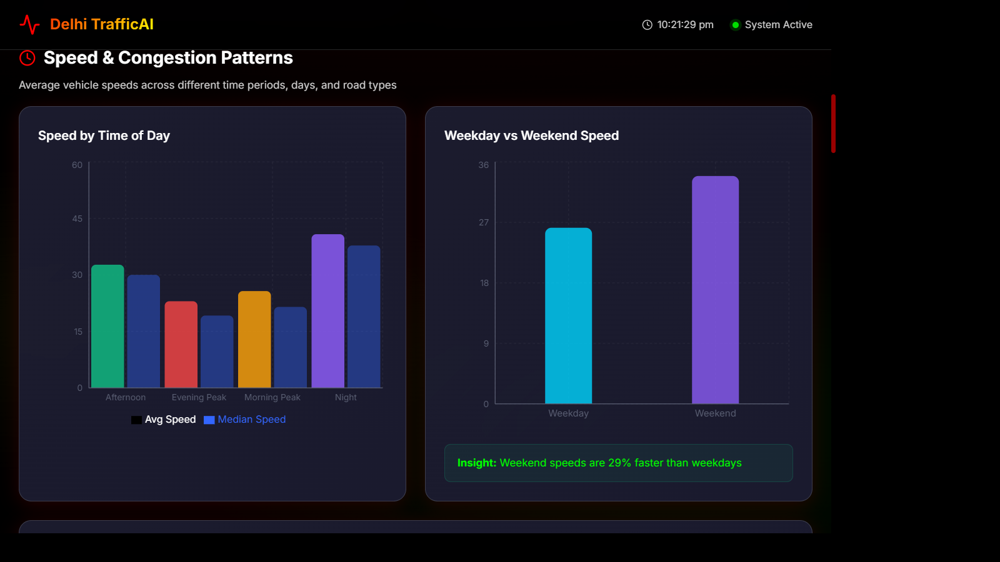
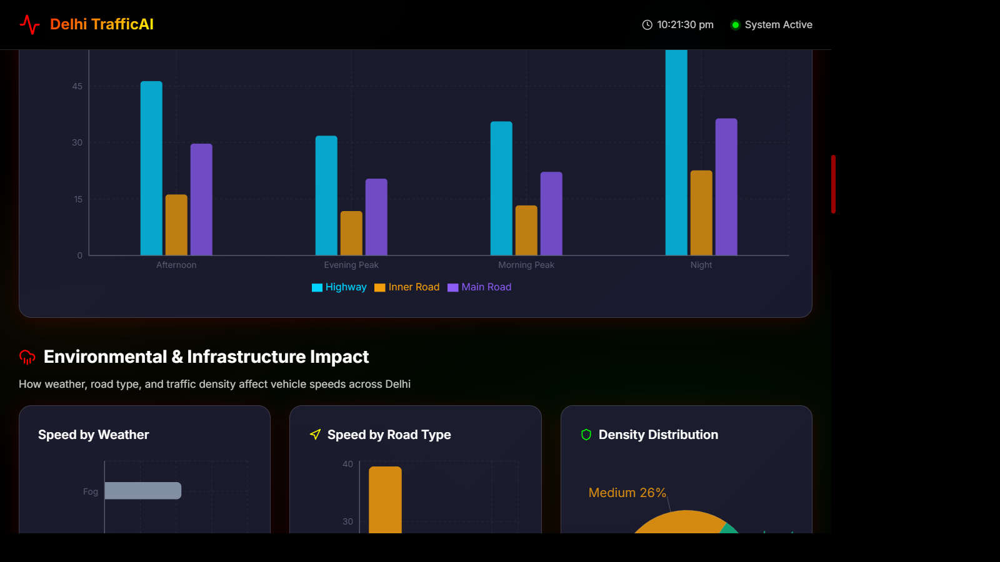
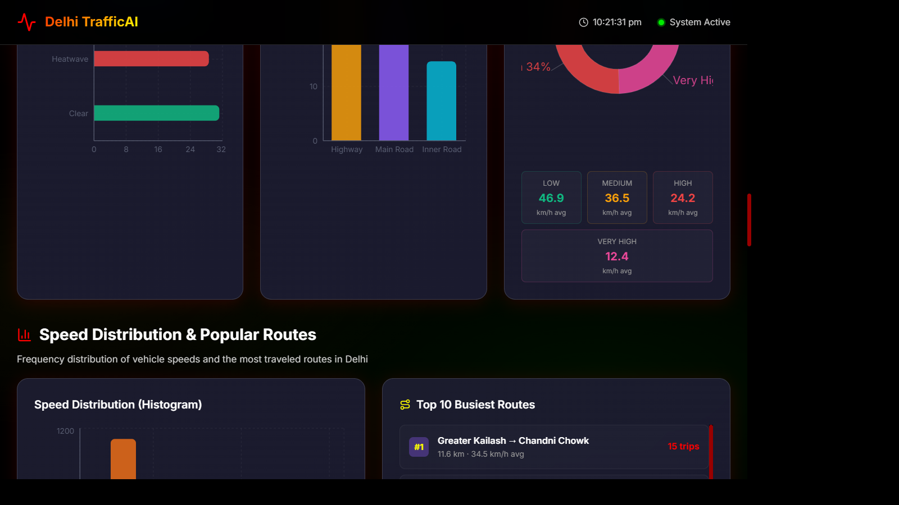
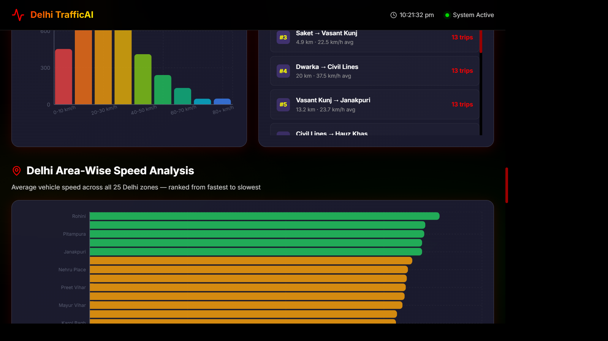
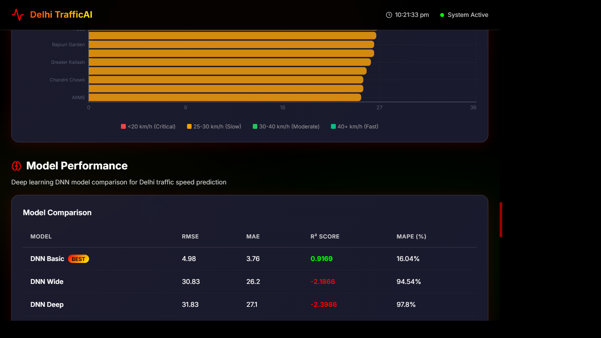

# Delhi TrafficAI: Smart Traffic Prediction System

[](https://tensorflow.org)
[](https://fastapi.tiangolo.com)
[](https://reactjs.org)
[](https://python.org)
[](LICENSE)

An end-to-end, production-grade Smart Traffic Prediction System powered by Deep Learning (DNNs). This system predicts vehicle speeds across 25 major zones in Delhi based on categorical features like weather, road type, time of day, and traffic density.

---

## Project Overview

**Delhi TrafficAI** provides real-time traffic speed forecasting across 25 Delhi zones using Deep Neural Network (DNN) ensembles. Built with TensorFlow/Keras backend and React frontend, it processes tabular trip data (4,000+ records) achieving **R² ≈ 0.91** accuracy. The system predicts vehicle speeds based on weather, road type, time of day, and traffic density with interactive glassmorphism-themed dashboards and SVG visualizations.

---

## Key Features

- **4 DNN Architectures**: Basic, Deep, Wide, Heavy-Dropout ensemble with categorical preprocessing
- **Real-Time Prediction**: Animated speedometer gauge, travel time estimation, route recommendations
- **Traffic Analytics**: Speed patterns by time/road type, environmental impact visualization, area-wise rankings
- **25 Delhi Zones**: Comprehensive coverage with historical data analysis and rush-hour alerts

---

## Tech Stack

**Backend**: FastAPI, TensorFlow/Keras, Pandas, NumPy, Scikit-Learn, Uvicorn  
**Frontend**: React 18 (Vite), Vanilla CSS (Dark Mode/Glassmorphism), Recharts, Lucide-React

---

## Screenshots

### Dashboard Overview


_Hero overview: key stats (avg speed, top origin, data points, peak speed, coverage zones)_

### Traffic Speed Prediction


_Interactive prediction panel with auto-calculated distance and inputs for route, road type, time and weather._

### Speed & Congestion Patterns


_Average speeds by time/road type and congestion indicators._

### Environmental & Infrastructure Impact


_Weather and road-type effects on speeds; density distribution visualization._

### Speed Distribution & Popular Routes


_Speed histogram and top routes combined for quick insights._

### Delhi Area-Wise Speed Analysis


_Ranked average speeds across 25 Delhi zones._

### Model Performance


_DNN comparison table and "BEST" badge for the selected model (metrics: R², RMSE, MAPE)._

---

## Folder Structure

```
Smart-Traffic-Prediction/
├── backend/          # FastAPI server, models, training, data pipeline
├── frontend/         # React dashboard, components, CSS (glassmorphism)
├── screenshots/      # 10 dashboard screenshots with new color theme
├── delhi_traffic_features.csv  # 4000+ trip records dataset
└── README.md
```

---

## Installation & Setup

**Backend**: `cd backend && pip install -r requirements.txt && python app.py` (FastAPI on :8000)  
**Frontend**: `cd frontend && npm install && npm run dev` (React on :5178)

---

## Project Description

**End-to-End Traffic Forecasting System** featuring:

- TensorFlow/Keras DNNs achieving **R² = 0.91** on 4,000+ Delhi traffic records
- Categorical data pipeline (One-Hot Encoding) for areas, weather, road types
- React dashboard with custom SVG visualizations and Recharts analytics
- 4 DNN architectures (Basic, Deep, Wide, Heavy-Dropout) for tabular data prediction

---

## Future Scope

- **Live IoT Integration**: Real-time GPS sensors and live traffic updates
- **Explainable AI (XAI)**: SHAP/LIME model interpretation for prediction transparency
- **Mobile App**: Flutter/React Native port for on-the-go route planning

---

## License

This project is licensed under the MIT License - see the [LICENSE](LICENSE) file for details.

---
