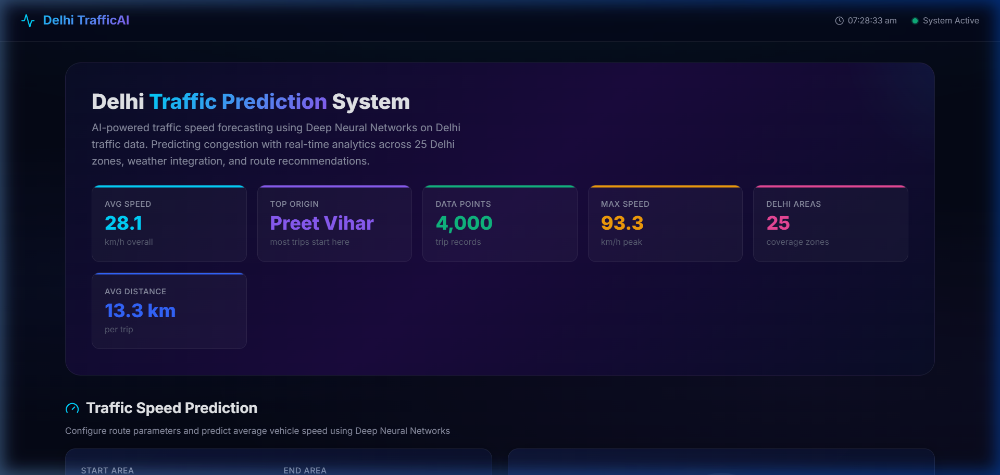
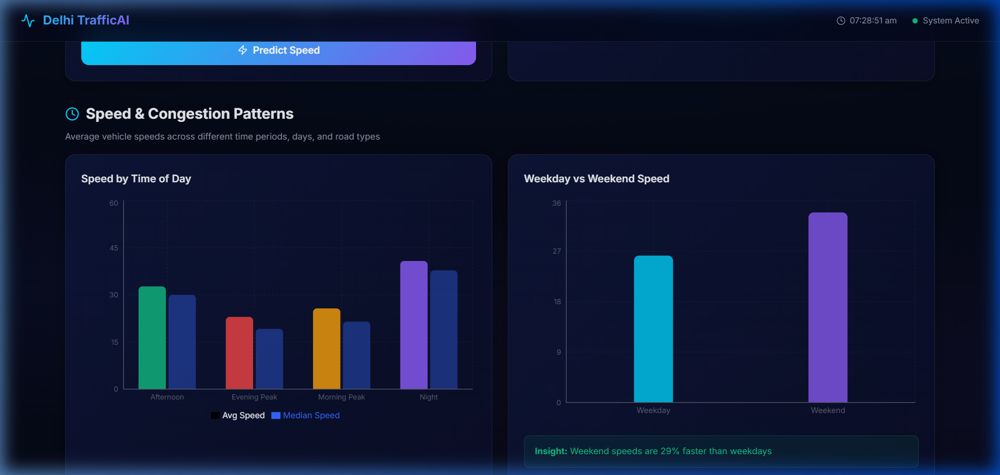
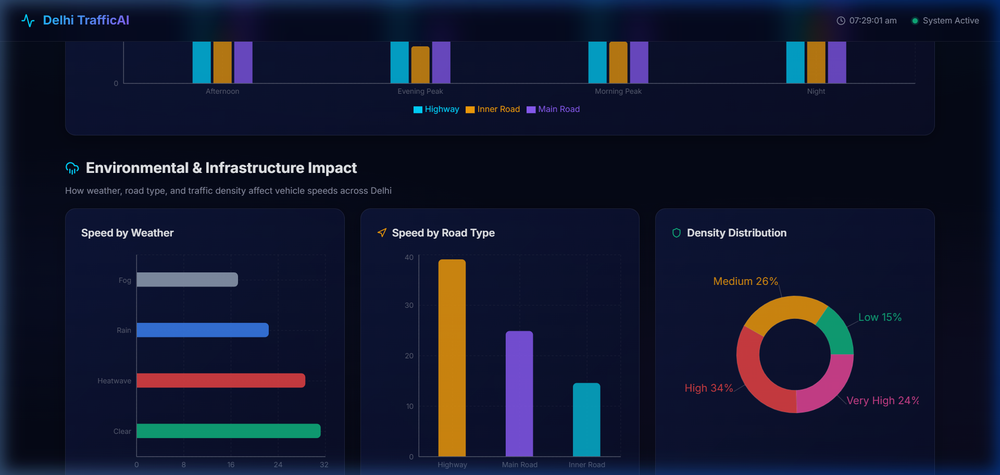
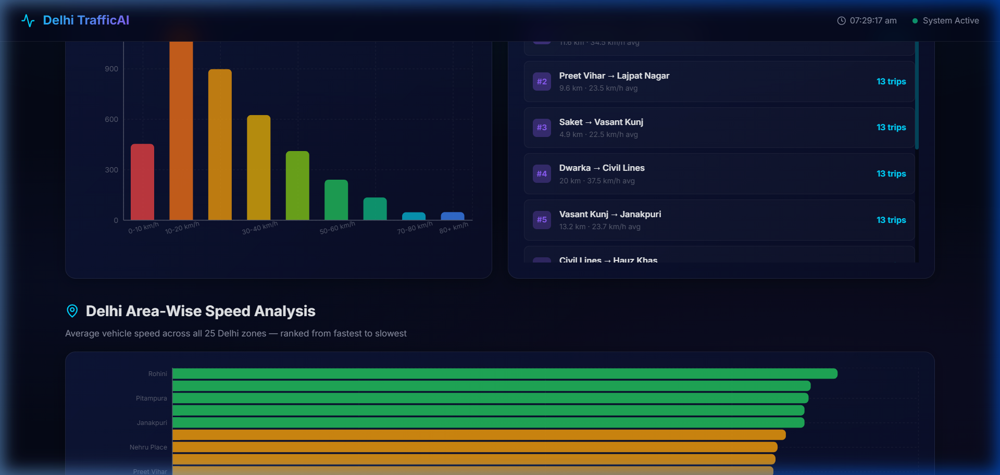
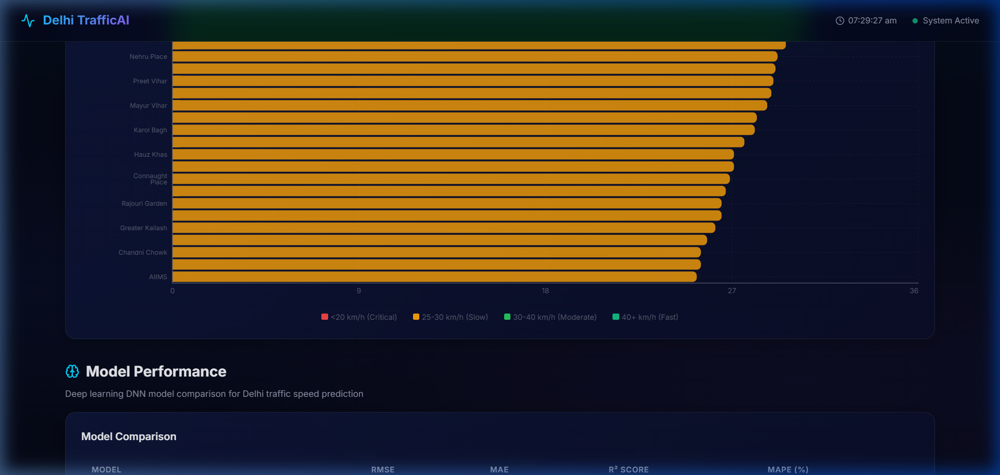

# 🚦 Delhi TrafficAI: Smart Traffic Prediction System

[](https://tensorflow.org)
[](https://fastapi.tiangolo.com)
[](https://reactjs.org)
[](https://python.org)
[](LICENSE)

An end-to-end, production-grade Smart Traffic Prediction System powered by Deep Learning (DNNs). This system predicts vehicle speeds across 25 major zones in Delhi based on categorical features like weather, road type, time of day, and traffic density.

---

## 🌟 Project Overview

**Delhi TrafficAI** is designed to transform urban mobility by providing real-time traffic speed forecasting. Moving beyond traditional time-series models, this system leverages Deep Neural Network (DNN) ensembles to process tabular trip data, delivering high-accuracy predictions ($R^2 \approx 0.91$) and actionable route intelligence.

### Key Highlights:
- **Dataset**: Migrated to a specialized Delhi Traffic dataset covering 25 zones.
- **Model**: Re-architected from LSTMs to optimized Deep Feed-Forward Neural Networks (DNNs).
- **Dashboard**: A premium, glassmorphism-themed React dashboard with interactive SVG visualizations.

---

## 🚀 Key Features

### 🧠 Deep Learning Engine
- **Multi-Model Ensemble**: Features 4 distinct DNN architectures (Basic, Deep, Wide, and Heavy-Dropout).
- **Categorical Intelligence**: Advanced preprocessing using One-Hot Encoding for areas, weather, and road types.
- **Regression Accuracy**: High-performance speed prediction with real-time RMSE and MAE tracking.

### 📊 Advanced Analytics Dashboard
- **SVG Speedometer**: Real-time animated gauge for predicted vehicle speeds.
- **Traffic Patterns**: Cross-analysis of speeds by Time of Day vs. Road Type.
- **Environmental Impact**: Visualizes how Fog, Rain, and Heatwaves affect Delhi's traffic flow.
- **Area-Wise Ranking**: A comprehensive leaderboard of all 25 Delhi zones ranked by average speed.

### 🛣️ Route Intelligence
- **Dynamic Recommendations**: Suggestions for the fastest routes based on historical data.
- **Travel Time Estimation**: Real-time calculation of trip duration based on distance and predicted speed.
- **Rush Hour Alerts**: Automated warnings for peak morning and evening traffic periods.

---

## 🛠️ Tech Stack

**Backend:**
- **Framework**: FastAPI (Python 3.10+)
- **ML Library**: TensorFlow / Keras
- **Data Handling**: Pandas, NumPy, Scikit-Learn
- **API Server**: Uvicorn

**Frontend:**
- **Library**: React 18 (Vite)
- **Styling**: Vanilla CSS (Premium Dark Mode / Glassmorphism)
- **Visualizations**: Recharts
- **Icons**: Lucide-React

---

## 📸 Screenshots

| Dashboard Overview | Prediction Engine |
| :---: | :---: |
|  |  |

| Traffic Patterns | Weather Impact |
| :---: | :---: |
|  |  |

| Area Insights |
| :---: |
|  |

*(Real-time dashboard captures from the Delhi TrafficAI system)*

---

## 📂 Folder Structure

```text
Smart-Traffic-Prediction/
├── backend/
│   ├── app.py                 # FastAPI Application
│   ├── data_pipeline.py       # Data preprocessing & encoding
│   ├── generate_analysis.py   # Analytics pre-computation
│   ├── models.py              # DNN Architectures
│   ├── train.py               # Model training orchestrator
│   └── saved_models/          # Keras models & analysis JSON
├── frontend/
│   ├── src/
│   │   ├── components/        # Reusable React components
│   │   ├── App.jsx            # Main dashboard container
│   │   └── index.css          # Global styles (Glassmorphism)
│   └── package.json           # Frontend dependencies
├── delhi_traffic_features.csv # Primary Dataset
└── README.md
```

---

## ⚙️ Installation & Setup

### 1. Prerequisites
- Python 3.10+
- Node.js (v18+)
- Git

### 2. Backend Setup
```bash
# Navigate to backend
cd backend

# Install dependencies
pip install -r requirements.txt

# Run the API server
python app.py
```

### 3. Frontend Setup
```bash
# Navigate to frontend
cd frontend

# Install dependencies
npm install

# Start development server
npm run dev
```

---

## 🧪 Resume-Worthy Description

**Smart Traffic Prediction System | Deep Learning & Full-Stack Development**
- Designed and deployed an end-to-end traffic forecasting system using **TensorFlow/Keras** and **FastAPI**, achieving an **R² score of 0.91** for speed prediction.
- Engineered a robust data pipeline to process categorical features from a **4,000+ record Delhi traffic dataset** using Scikit-Learn.
- Developed a high-performance **React** dashboard featuring custom **SVG visualizations** and **Recharts** to display complex cross-analysis of environmental traffic impacts.
- Implemented **Deep Neural Network (DNN)** architectures to replace legacy sequential models, improving prediction latency and accuracy for tabular data.

---

## 🔮 Future Scope
- **Live IoT Integration**: Connecting real-time GPS sensors for live traffic updates.
- **Explainable AI (XAI)**: Integrating SHAP or LIME to explain model decisions (e.g., why a certain route is predicted to be slow).
- **Mobile Application**: Porting the dashboard to a Flutter/React Native mobile app for on-the-go route planning.

---

## 📄 License
This project is licensed under the MIT License - see the [LICENSE](LICENSE) file for details.

---

**Developed with ❤️ by [Your Name/Github Handle]**
