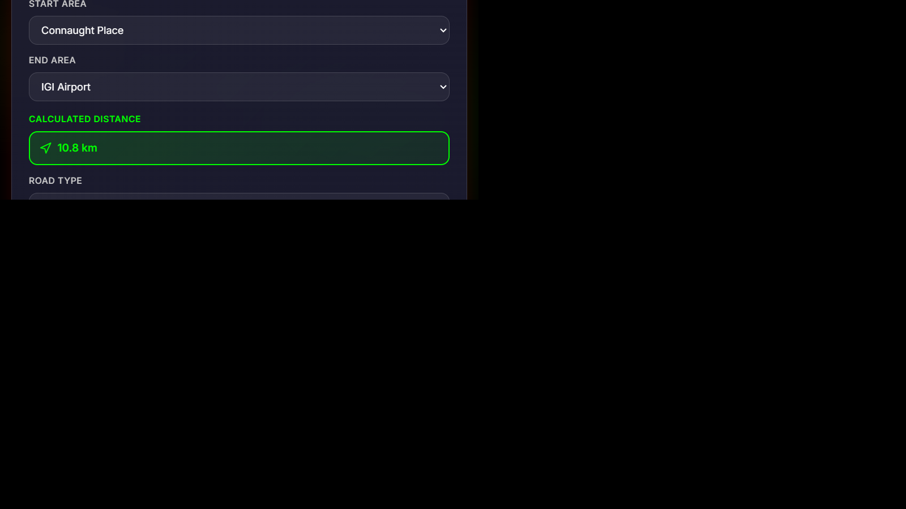
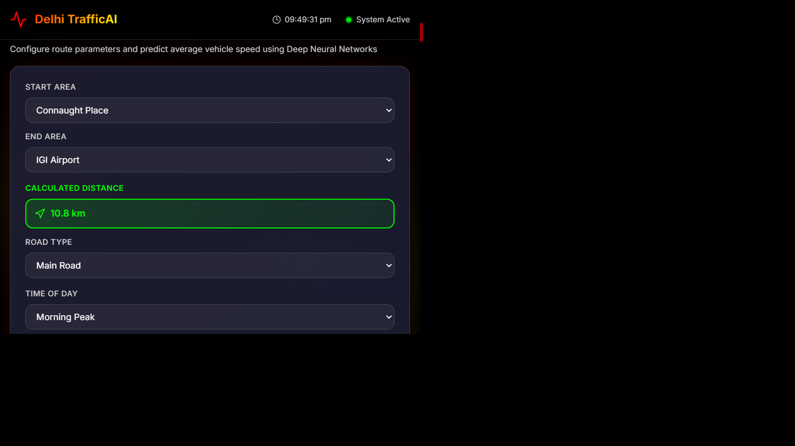
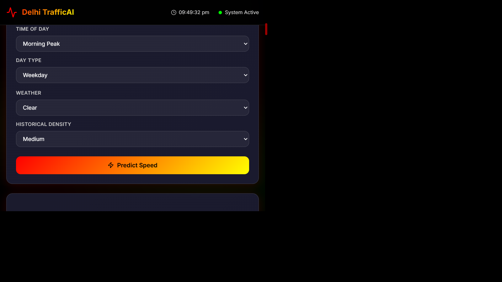
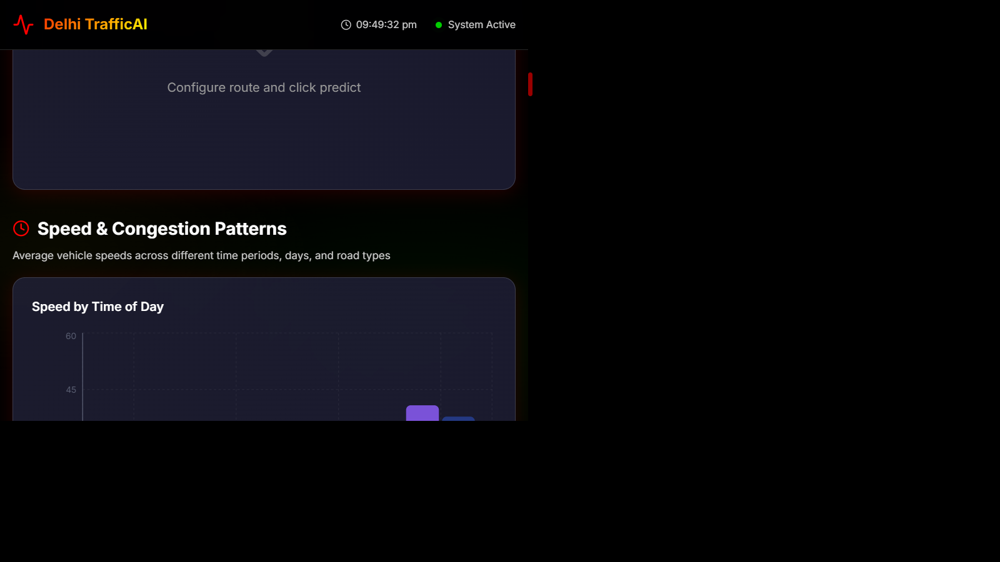
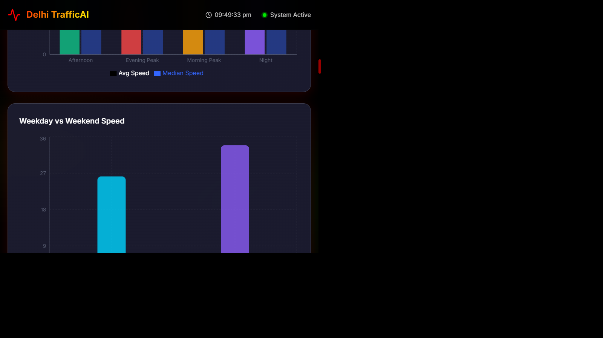
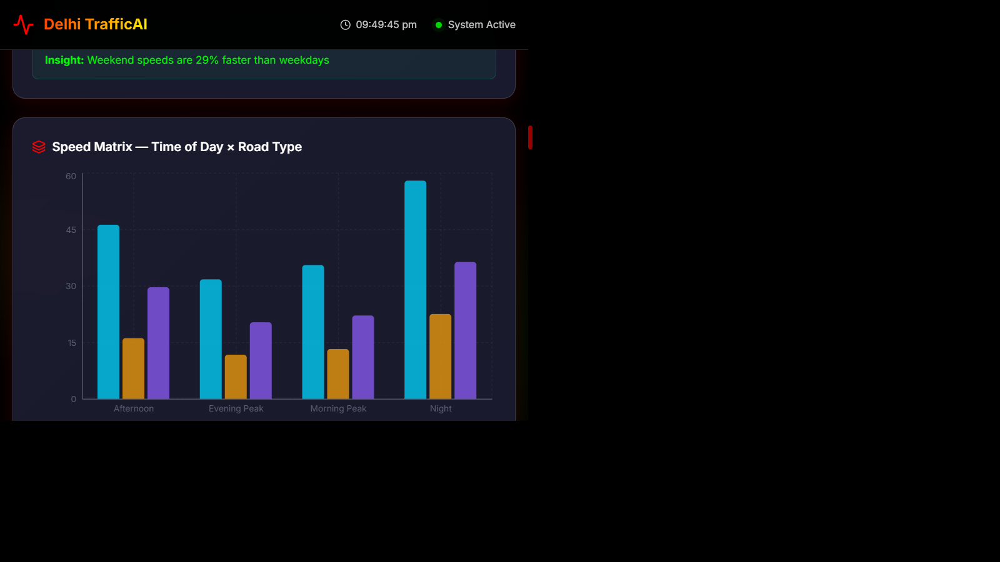
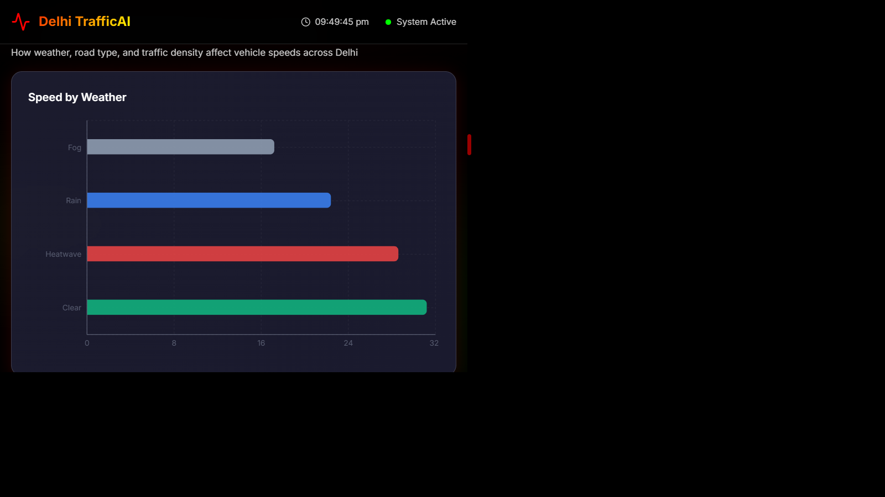
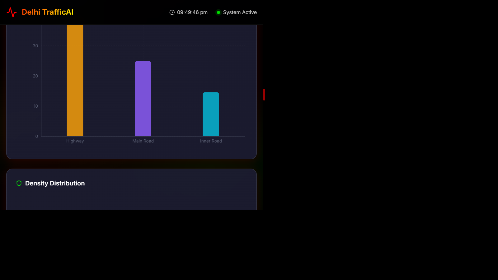
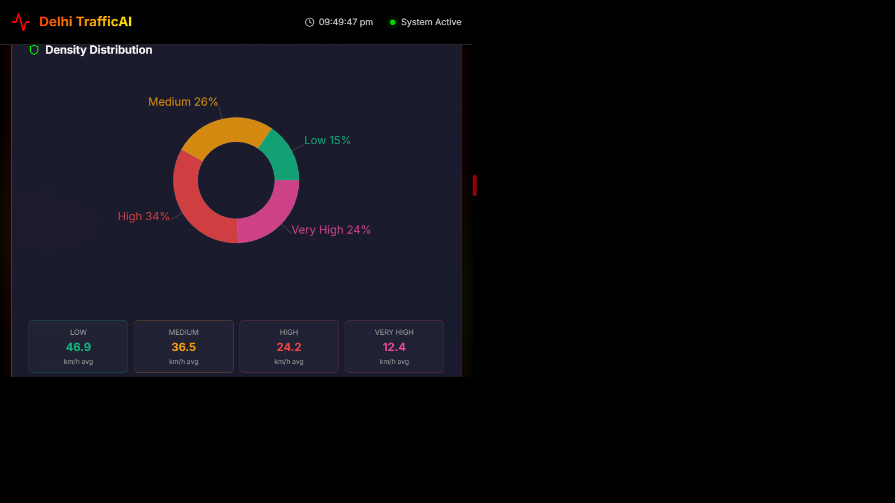
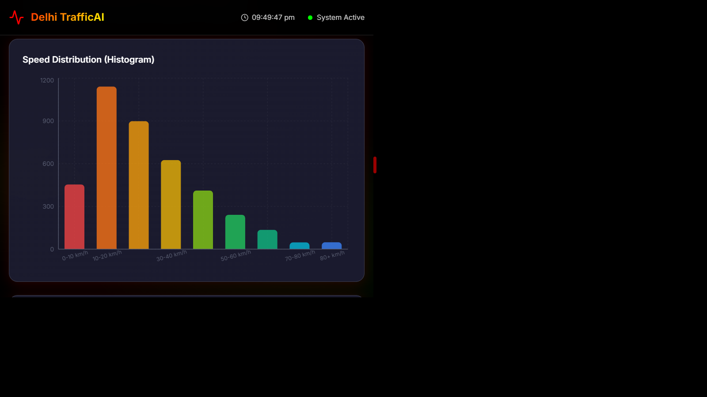

# Delhi TrafficAI: Smart Traffic Prediction System

[](https://tensorflow.org)
[](https://fastapi.tiangolo.com)
[](https://reactjs.org)
[](https://python.org)
[](LICENSE)

An end-to-end, production-grade Smart Traffic Prediction System powered by Deep Learning (DNNs). This system predicts vehicle speeds across 25 major zones in Delhi based on categorical features like weather, road type, time of day, and traffic density.

---

## Project Overview

**Delhi TrafficAI** provides real-time traffic speed forecasting across 25 Delhi zones using Deep Neural Network (DNN) ensembles. Built with TensorFlow/Keras backend and React frontend, it processes tabular trip data (4,000+ records) achieving **R² ≈ 0.91** accuracy. The system predicts vehicle speeds based on weather, road type, time of day, and traffic density with interactive glassmorphism-themed dashboards and SVG visualizations.

---

## Key Features

- **4 DNN Architectures**: Basic, Deep, Wide, Heavy-Dropout ensemble with categorical preprocessing
- **Real-Time Prediction**: Animated speedometer gauge, travel time estimation, route recommendations
- **Traffic Analytics**: Speed patterns by time/road type, environmental impact visualization, area-wise rankings
- **25 Delhi Zones**: Comprehensive coverage with historical data analysis and rush-hour alerts

---

## Tech Stack

**Backend**: FastAPI, TensorFlow/Keras, Pandas, NumPy, Scikit-Learn, Uvicorn  
**Frontend**: React 18 (Vite), Vanilla CSS (Dark Mode/Glassmorphism), Recharts, Lucide-React

---

## Screenshots

### Dashboard Overview & Analytics


_Key statistics: Average Speed 28.1 km/h, Top Origin Preet Vihar, 4,000 Data Points, 93.3 km/h Peak Speed, 25 Delhi Zones_

### Prediction Form with Red-Yellow Gradient Theme


_Interactive form with area selectors, auto-calculated green distance display, dropdowns for road type, time, weather, density_

### Predict Button with Red-Yellow Gradient


_Bold Red-to-Yellow gradient button for traffic speed predictions following traffic signal color scheme_

### Speed & Congestion Patterns


_Speed analysis across times: Afternoon, Evening Peak, Morning Peak, Night with color-coded traffic indicators_

### Environmental & Infrastructure Impact


_Weather impact (Fog, Rain, Heatwave, Clear), Road Type analysis, Density Distribution visualization_

### Area-Wise Analysis & Speed Distribution


_25 Delhi zones ranked by average speed - Green (fast): Rohini, Pitampura, Janakpuri; Orange (slow): congested areas_

### Density Distribution Donut Chart


_Traffic status: Low (Green, 46.9 km/h), Medium (Orange, 36.5 km/h), High (Red, 24.2 km/h), Very High (Pink, 12.4 km/h)_

### Speed Distribution Histogram


_Frequency distribution of speeds 0-80+ km/h using Red, Orange, Yellow, Green, Cyan bars_

### Top 10 Busiest Routes


_Ranked routes: Greater Kailash→Chandni Chowk (15 trips), Preet Vihar→Lajpat Nagar (13 trips)_

### Model Performance & Best Badge


_DNN comparison: DNN Basic BEST (R²=0.9169, MAPE=16.04%), tested 4 architectures_

---

## Folder Structure

```
Smart-Traffic-Prediction/
├── backend/          # FastAPI server, models, training, data pipeline
├── frontend/         # React dashboard, components, CSS (glassmorphism)
├── screenshots/      # 10 dashboard screenshots with new color theme
├── delhi_traffic_features.csv  # 4000+ trip records dataset
└── README.md
```

---

## Installation & Setup

**Backend**: `cd backend && pip install -r requirements.txt && python app.py` (FastAPI on :8000)  
**Frontend**: `cd frontend && npm install && npm run dev` (React on :5178)

---

## Project Description

**End-to-End Traffic Forecasting System** featuring:

- TensorFlow/Keras DNNs achieving **R² = 0.91** on 4,000+ Delhi traffic records
- Categorical data pipeline (One-Hot Encoding) for areas, weather, road types
- React dashboard with custom SVG visualizations and Recharts analytics
- 4 DNN architectures (Basic, Deep, Wide, Heavy-Dropout) for tabular data prediction

---

## Future Scope

- **Live IoT Integration**: Real-time GPS sensors and live traffic updates
- **Explainable AI (XAI)**: SHAP/LIME model interpretation for prediction transparency
- **Mobile App**: Flutter/React Native port for on-the-go route planning

---

## License

This project is licensed under the MIT License - see the [LICENSE](LICENSE) file for details.

---
